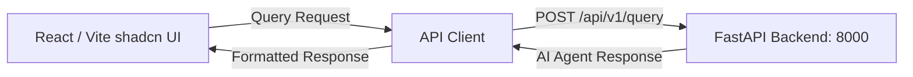

# Financial Assistant Frontend

> A minimalist AI Financial Assistant web dashboard built with **React**, **Vite**, and **shadcn/ui** design aesthetics.

[](https://react.dev/)
[](https://vitejs.dev/)
[](https://ui.shadcn.com/)
[](https://lucide.dev/)

---

## Overview

This frontend provides a minimalist interface for interacting with the **Financial Assistant LangChain Agent**. It features a clean dark mode, responsive cards, prompt pills, real-time query processing, and markdown response formatting.

---

## Key Features

- **Minimalist shadcn/ui Aesthetic:** Zinc dark mode (`#09090b`), clean 1px borders (`#27272a`), refined typography using Inter and JetBrains Mono.
- **Dynamic Prompt Pills:** One-click sample questions for stock lookup, portfolio ROI, and currency conversion.
- **Auto-expanding Query Input:** Textarea card with keyboard shortcut support (`Enter` to submit, `Shift+Enter` for new lines).
- **Structured Synthesis Cards:** Clean assistant responses with tool attribution, copy-to-clipboard, and timestamps.
- **Real-Time Health Monitoring:** Automatic polling connected to the FastAPI `/health` endpoint.

---

## Architecture



---

## Getting Started

### 1. Prerequisites
- Node.js 18+ and npm

### 2. Installation & Setup

Navigate to the Frontend directory:
```bash
cd "Financial Agent/Frontend"
```

Install dependencies:
```bash
npm install
```

### 3. Run Development Server

```bash
npm run dev
```

The web dashboard will be live at `http://localhost:3000` (or `http://localhost:5173`).

---

## Project Structure

```text
Frontend/
├── src/
│   ├── components/
│   │   └── MarkdownRenderer.jsx # Minimalist markdown parser for agent responses
│   ├── App.jsx                 # Main application with shadcn layout & state
│   ├── index.css               # shadcn UI tokens, HSL variables & utilities
│   └── main.jsx                # React root entrypoint
├── index.html                  # HTML template with Inter & JetBrains Mono fonts
├── package.json                # Project scripts & dependencies
├── vite.config.js              # Vite configuration
└── README.md                   # Frontend documentation
```

---

## License

Distributed under the MIT License.
